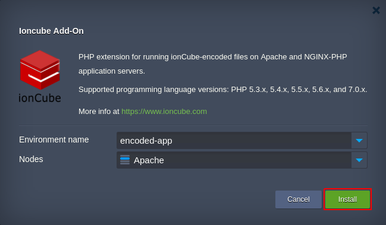
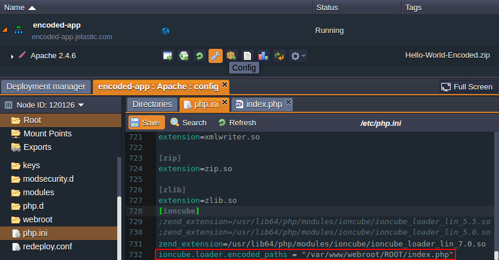

# ionCube Loader Add-On 

The [ionCube Loader](https://www.ioncube.com/loaders.php) is a PHP extension for running files that were preliminary secured with [ionCube Encoder](https://www.ioncube.com/php_encoder.php). Within Jelastic Cloud, the ionCube Loader decoder is provided as an applicable add-on for one-click installation.

**Stacks this add-on can be applied to:** *Apache* and *NGINX-PHP* application servers

**Supported PHP versions:**
- *5.3.*
- *5.4.*
- *5.5.*
- *5.6.*
- *7.0.*

For more information about [Jelastic Add-Ons](https://github.com/jelastic-jps/jpswiki/wiki/Jelastic-Addons) and their usage, refer to the linked guide.

## How to Install ionCube Loader to Jelastic Environment

To install the ionCube Loader add-on, copy link to the **_manifest.jps_** file above and [import](https://docs.jelastic.com/environment-import) it through the Jelastic dashboard at your [platform](https://jelastic.cloud/) (alternatively, it can be launched from the embedded [Jelastic Marketplace](https://docs.jelastic.com/marketplace#add-ons)).

In the appeared installation window, specify the following details:
- **_Environment name_** - environment the ionCube tool should be integrated to (encoded-app in our case)
- **_Nodes_** - target PHP application server for the add-on appliance (is fetched automatically upon selecting the environment)

Click on **Install** to proceed. Just after installation is finished, you can [deploy](https://docs.jelastic.com/whole-project-deploying) and run any ionCube-encoded PHP application in a usual way. 

## How to Customize ionCube Configurations

Since ionCube Loader represents a PHP extension, its settings can be adjusted within **_php.ini_** configuration file at your application server. To access it, click **Config** next to the corresponding node and select this file in the leftmost _File manager_ panel.

Here, you can point Loader to the server location with your encoded files (or directly to the require ones), specifying the appropriate path within the **_ioncube.loader.encoded_paths_** directive as it is shown above. 

For more information on the ionCube add-on installation and customization, refer to the following [article](http://blog.jelastic.com/2017/05/11/running-encoded-php-scripts-with-ioncube-loader/).

## Known Limitations on PHP Versions Compatibility

When selecting a particular engine, you need to consider its compatibility with ionCube Encoder version your scripts were initially converted with. As a general rule of thumb, encoded files could be processed on PHP versions that are equal to and higher than the source Encoder language, i.e. the full backward compatibility is provided. However, there are a few exceptions:
- currently, *PHP 7.1* is not supported 
- with *PHP 7.0* engine, only *PHP 5.6*-based files can be decoded
- with *PHP 5.6* and *PHP 5.5*, scripts of *PHP 4* version can’t be decoded

